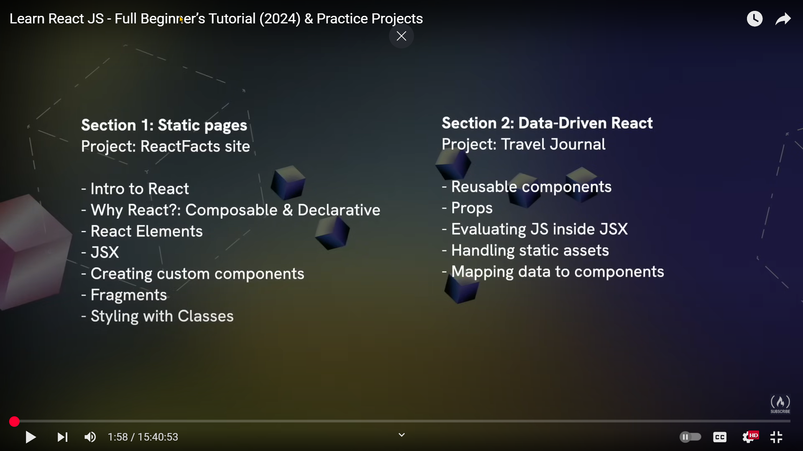
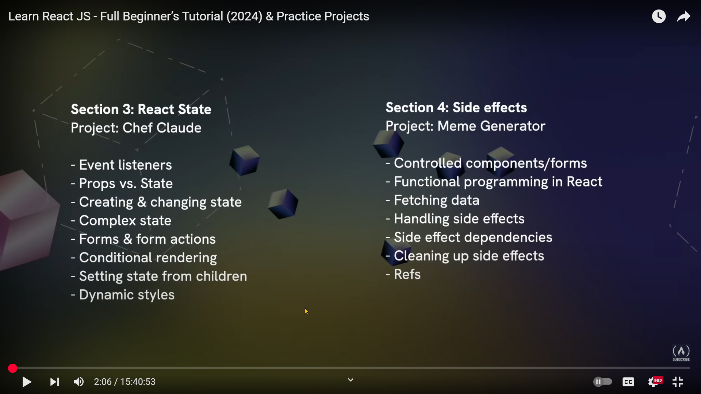
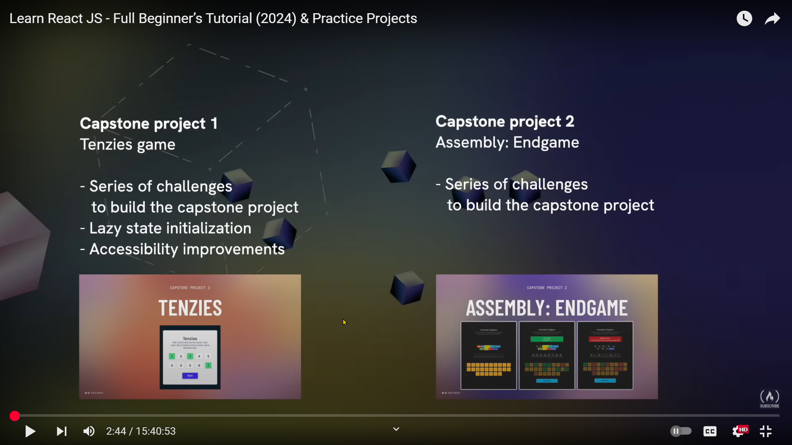

# About

Repository to follow lessons of [Bob Ziroll in freeCodeCamp.org](https://www.youtube.com/watch?v=x4rFhThSX04)

# Time stamps and links for each teaching lesson

## Section 1 and Section 2:

- 6:09: [**Lesson 1**: Static Pages + What We'll Learn](https://www.youtube.com/watch?v=x4rFhThSX04&t=369s)
- 8:39: [**Lesson 2**: First React Code](https://www.youtube.com/watch?v=x4rFhThSX04&t=519s)
- 15:20: [**Lesson 3**: First React Challenge](https://www.youtube.com/watch?v=x4rFhThSX04&t=920s)
- 18:19: [**Lesson 4**: Local Setup w/Vite](https://www.youtube.com/watch?v=x4rFhThSX04&t=1099s)
- 24:25: [**Lesson 5**: Libraries/Frameworks](https://www.youtube.com/watch?v=x4rFhThSX04&t=1465s)
- 33:20: [**Lesson 6**: React CreateElm](https://www.youtube.com/watch?v=x4rFhThSX04&t=2000s)
- 36:10: [**Lesson 7**: JSX](https://www.youtube.com/watch?v=x4rFhThSX04&t=2170s)
- 38:27: [**Lesson 8**: Why React?](https://www.youtube.com/watch?v=x4rFhThSX04&t=2307s)
- 51:30: [**Lesson 10**: Random Housekeeping](https://www.youtube.com/watch?v=x4rFhThSX04&t=3090s)
- 1:00:15: [**Lesson 11**: ReactFunFacts Project Mark-Up](https://www.youtube.com/watch?v=x4rFhThSX04&t=3615s)
- 1:04:02: [**Lesson 12**: Pop Quiz](https://www.youtube.com/watch?v=x4rFhThSX04&t=3842s)
- 1:10:17: [**Lesson 13**: Custom Components Part 1](https://www.youtube.com/watch?v=x4rFhThSX04&t=4217s)
- 1:17:01: [**Lesson 14**: Custom Components Part 2](https://www.youtube.com/watch?v=x4rFhThSX04&t=4621s)
- 1:20:41: [**Lesson 15**: Custom Components Quiz](https://www.youtube.com/watch?v=x4rFhThSX04&t=4841s)
- 1:23:26: [**Lesson 16**: Fragments](https://www.youtube.com/watch?v=x4rFhThSX04&t=5006s)
- 1:25:59: [**Lesson 17**: Custom Components Parent/Child](https://www.youtube.com/watch?v=x4rFhThSX04&t=5159s)
- 1:31:24: [**Lesson 18**: Styling With Classes](https://www.youtube.com/watch?v=x4rFhThSX04&t=5484s)
- 1:40:04: [Organizing Components](https://www.youtube.com/watch?v=x4rFhThSX04&t=6004s)
- 1:45:31: [Make Mental Outline of Project](https://www.youtube.com/watch?v=x4rFhThSX04&t=6331s)
- 1:49:24: [Initial Project Setup](https://www.youtube.com/watch?v=x4rFhThSX04&t=6564s)
- 1:54:04: [ReactFacts Navbar & Styling](https://www.youtube.com/watch?v=x4rFhThSX04&t=6844s)
- 2:02:10: [Main Content Section](https://www.youtube.com/watch?v=x4rFhThSX04&t=7330s)
- 2:08:46: [Coloring the Bullets](https://www.youtube.com/watch?v=x4rFhThSX04&t=7726s)
- 2:10:58: [Add BG Image](https://www.youtube.com/watch?v=x4rFhThSX04&t=7858s)
- 2:15:45: [Section 1 Recap Section 2](https://www.youtube.com/watch?v=x4rFhThSX04&t=8145s)
- 2:18:00: [Section 2 Intro](https://www.youtube.com/watch?v=x4rFhThSX04&t=8280s)
- 2:20:28: [Travel Journal Header](https://www.youtube.com/watch?v=x4rFhThSX04&t=8428s)
- 2:28:05: [Entry Component](https://www.youtube.com/watch?v=x4rFhThSX04&t=8885s)
- 2:38:14: [Problem - Not Reusable](https://www.youtube.com/watch?v=x4rFhThSX04&t=9494s)
- 2:40:33: [Props Part 1: Understanding the Concept](https://www.youtube.com/watch?v=x4rFhThSX04&t=9633s)
- 2:43:51: [Props Part 2: Reusable Component](https://www.youtube.com/watch?v=x4rFhThSX04&t=9831s)
- 2:45:47: [Aside: JS Inside JSX](https://www.youtube.com/watch?v=x4rFhThSX04&t=9947s)
- 2:53:32: [Props Part 3: Create a Contact Component](https://www.youtube.com/watch?v=x4rFhThSX04&t=10412s)
- 2:57:19: [Passing Data Into a Component](https://www.youtube.com/watch?v=x4rFhThSX04&t=10639s)
- 3:04:57: [Props Part 5: Receiving Props](https://www.youtube.com/watch?v=x4rFhThSX04&t=11097s)
- 3:12:30: [Props Quiz](https://www.youtube.com/watch?v=x4rFhThSX04&t=11550s)
- 3:16:57: [Destructuring Props](https://www.youtube.com/watch?v=x4rFhThSX04&t=11817s)
- 3:22:10: [Props Practice](https://www.youtube.com/watch?v=x4rFhThSX04&t=12130s)
- 3:31:10: [Non-String Props](https://www.youtube.com/watch?v=x4rFhThSX04&t=12670s)
- 3:37:24: [Importing Static Assets](https://www.youtube.com/watch?v=x4rFhThSX04&t=13044s)
- 3:40:26: [Pass Props to Entry Component](https://www.youtube.com/watch?v=x4rFhThSX04&t=13226s)
- 3:46:53: [Review Array .map()](https://www.youtube.com/watch?v=x4rFhThSX04&t=13613s)
- 3:54:23: [React Can Render Arrays](https://www.youtube.com/watch?v=x4rFhThSX04&t=14063s)
- 3:59:37: [Mapping Component](https://www.youtube.com/watch?v=x4rFhThSX04&t=14377s)
- 4:05:46: [Map Quiz](https://www.youtube.com/watch?v=x4rFhThSX04&t=14746s)
- 4:09:51: [Travel Journal: Map Entry Component](https://www.youtube.com/watch?v=x4rFhThSX04&t=14991s)
- 4:16:36: [Travel Journal: Key Prop](https://www.youtube.com/watch?v=x4rFhThSX04&t=15396s)
- 4:20:51: [Travel Journal: Pass Object as Props](https://www.youtube.com/watch?v=x4rFhThSX04&t=15651s)
- 4:26:33: [Travel Journal: Spread Object as Props](https://www.youtube.com/watch?v=x4rFhThSX04&t=15993s)
- 4:30:53: [Section 2 Recap Section 3](https://www.youtube.com/watch?v=x4rFhThSX04&t=16253s)

## Section 3 and Section 4:

- 4:33:02: [Section 3 Intro](https://www.youtube.com/watch?v=x4rFhThSX04&t=16382s)
- 4:37:41: [Chef Claude: Header](https://www.youtube.com/watch?v=x4rFhThSX04&t=16661s)
- 4:45:51: [Chef Claude: Form](https://www.youtube.com/watch?v=x4rFhThSX04&t=17151s)
- 4:55:46: [Project Overview](https://www.youtube.com/watch?v=x4rFhThSX04&t=17746s)
- 4:57:34: [Event Listeners](https://www.youtube.com/watch?v=x4rFhThSX04&t=17854s)
- 5:03:56: [Map Ingredients List](https://www.youtube.com/watch?v=x4rFhThSX04&t=18236s)
- 5:13:47: [Props vs. State: Props](https://www.youtube.com/watch?v=x4rFhThSX04&t=18827s)
- 5:18:08: [Props vs. State: State](https://www.youtube.com/watch?v=x4rFhThSX04&t=19088s)
- 5:23:52: [useState](https://www.youtube.com/watch?v=x4rFhThSX04&t=19432s)
- 5:29:13: [useState Array Destructuring](https://www.youtube.com/watch?v=x4rFhThSX04&t=19753s)
- 5:31:13: [Changing State](https://www.youtube.com/watch?v=x4rFhThSX04&t=19873s)
- 5:36:10: [State Practice](https://www.youtube.com/watch?v=x4rFhThSX04&t=20170s)
- 5:42:49: [Updating State With a Callback Function](https://www.youtube.com/watch?v=x4rFhThSX04&t=20569s)
- 5:48:37: [Changing State Quiz](https://www.youtube.com/watch?v=x4rFhThSX04&t=20917s)
- 5:50:40: [Ternary Practice](https://www.youtube.com/watch?v=x4rFhThSX04&t=21040s)
- 5:54:37: [Toggling State](https://www.youtube.com/watch?v=x4rFhThSX04&t=21277s)
- 6:01:11: [Complex State: Arrays](https://www.youtube.com/watch?v=x4rFhThSX04&t=21671s)
- 6:11:12: [Chef Claude: Refactor Array State](https://www.youtube.com/watch?v=x4rFhThSX04&t=22272s)
- 6:14:37: [Complex State: Objects](https://www.youtube.com/watch?v=x4rFhThSX04&t=22477s)
- 6:21:36: [Complex State: Updating State Objects](https://www.youtube.com/watch?v=x4rFhThSX04&t=22896s)
- 6:26:20: [React Forms Intro](https://www.youtube.com/watch?v=x4rFhThSX04&t=23180s)
- 6:31:33: [Form Basics](https://www.youtube.com/watch?v=x4rFhThSX04&t=23493s)
- 6:39:05: [Form Submission](https://www.youtube.com/watch?v=x4rFhThSX04&t=23945s)
- 6:45:48: [Form Action](https://www.youtube.com/watch?v=x4rFhThSX04&t=24348s)
- 6:49:47: [Chef Claude: Refactor Form Submission](https://www.youtube.com/watch?v=x4rFhThSX04&t=24587s)
- 6:52:39: [Forms: Textarea & DefaultValue](https://www.youtube.com/watch?v=x4rFhThSX04&t=24759s)
- 6:55:52: [Forms: Radio](https://www.youtube.com/watch?v=x4rFhThSX04&t=24952s)
- 7:03:19: [Forms: Checkbox](https://www.youtube.com/watch?v=x4rFhThSX04&t=25399s)
- 7:07:15: [Forms: Select and Option](https://www.youtube.com/watch?v=x4rFhThSX04&t=25635s)
- 7:12:48: [Forms: Object.FormEntries](https://www.youtube.com/watch?v=x4rFhThSX04&t=25968s)
- 7:17:21: [Chef Claude: Conditional Rendering Intro](https://www.youtube.com/watch?v=x4rFhThSX04&t=26241s)
- 7:19:39: [Conditional Rendering: &&](https://www.youtube.com/watch?v=x4rFhThSX04&t=26379s)
- 7:25:53: [Conditional Rendering: Why Does && Work?](https://www.youtube.com/watch?v=x4rFhThSX04&t=26753s)
- 7:30:24: [Practice: &&](https://www.youtube.com/watch?v=x4rFhThSX04&t=27024s)
- 7:35:26: [Conditional Rendering: Ternary](https://www.youtube.com/watch?v=x4rFhThSX04&t=27326s)
- 7:41:02: [Practice](https://www.youtube.com/watch?v=x4rFhThSX04&t=27662s)
- 7:45:31: [Quiz](https://www.youtube.com/watch?v=x4rFhThSX04&t=27931s)
- 7:47:46: [Conditional Rendering Challenge 1](https://www.youtube.com/watch?v=x4rFhThSX04&t=28066s)
- 7:52:44: [Challenge 2](https://www.youtube.com/watch?v=x4rFhThSX04&t=28364s)
- 7:54:51: [Get Recipe Placeholder Challenge](https://www.youtube.com/watch?v=x4rFhThSX04&t=28491s)
- 8:02:27: [Passing State as Props](https://www.youtube.com/watch?v=x4rFhThSX04&t=28947s)
- 8:09:35: [Setting State From Child Component](https://www.youtube.com/watch?v=x4rFhThSX04&t=29375s)
- 8:17:35: [Passing Data Around React](https://www.youtube.com/watch?v=x4rFhThSX04&t=29855s)
- 8:24:57: [Sound Pads Challenge Part 1](https://www.youtube.com/watch?v=x4rFhThSX04&t=30297s)
- 8:29:13: [Dynamic Styles](https://www.youtube.com/watch?v=x4rFhThSX04&t=30553s)
- 8:35:55: [Challenge Part 2](https://www.youtube.com/watch?v=x4rFhThSX04&t=30955s)
- 8:39:41: [Challenge Part 3](https://www.youtube.com/watch?v=x4rFhThSX04&t=31181s)
- 8:44:01: [Challenge Part 4.1 Local State](https://www.youtube.com/watch?v=x4rFhThSX04&t=31441s)
- 8:48:52: [Challenge Part 4.2 Shared State](https://www.youtube.com/watch?v=x4rFhThSX04&t=31732s)
- 8:55:41: [Challenge Part 4.3 Updating Item in Array](https://www.youtube.com/watch?v=x4rFhThSX04&t=32141s)
- 9:07:51: [Chef Claude Challenge](https://www.youtube.com/watch?v=x4rFhThSX04&t=32871s)
- 9:17:37: [API Sign-Ups](https://www.youtube.com/watch?v=x4rFhThSX04&t=33457s)
- 9:26:32: [AI Code Walkthrough](https://www.youtube.com/watch?v=x4rFhThSX04&t=33992s)
- 9:33:37: [Challenge Quiz](https://www.youtube.com/watch?v=x4rFhThSX04&t=34417s)
- 9:36:35: [Challenge: Get Recipe](https://www.youtube.com/watch?v=x4rFhThSX04&t=34595s)
- 9:43:53: [Format Recipe Response](https://www.youtube.com/watch?v=x4rFhThSX04&t=35033s)
- 9:49:03: [Section 3 Outro Section 4](https://www.youtube.com/watch?v=x4rFhThSX04&t=35343s)
- 9:51:21: [Section 4 Intro](https://www.youtube.com/watch?v=x4rFhThSX04&t=35481s)
- 9:54:02: [Meme Generator Starting Point](https://www.youtube.com/watch?v=x4rFhThSX04&t=35642s)
- 9:56:31: [Meme Generator State](https://www.youtube.com/watch?v=x4rFhThSX04&t=35791s)
- 9:59:16: [Controlled Component Part 1](https://www.youtube.com/watch?v=x4rFhThSX04&t=35956s)
- 10:05:16: [Controlled Component Part 2](https://www.youtube.com/watch?v=x4rFhThSX04&t=36316s)
- 10:10:59: [Planning Data Fetch](https://www.youtube.com/watch?v=x4rFhThSX04&t=36659s)
- 10:13:08: [Functional Programming in React](https://www.youtube.com/watch?v=x4rFhThSX04&t=36788s)
- 10:18:05: [Fetching Data in React](https://www.youtube.com/watch?v=x4rFhThSX04&t=37085s)
- 10:24:08: [Intro to useEffect](https://www.youtube.com/watch?v=x4rFhThSX04&t=37448s)
- 10:26:54: [useEffect Syntax and Default Behavior](https://www.youtube.com/watch?v=x4rFhThSX04&t=37614s)
- 10:30:47: [useEffect Dependencies Array](https://www.youtube.com/watch?v=x4rFhThSX04&t=37847s)
- 10:38:20: [useEffect Empty Dependencies Array](https://www.youtube.com/watch?v=x4rFhThSX04&t=38300s)
- 10:41:00: [useEffect Quiz](https://www.youtube.com/watch?v=x4rFhThSX04&t=38460s)
- 10:45:57: [useEffect Practice](https://www.youtube.com/watch?v=x4rFhThSX04&t=38757s)
- 10:50:44: [Fetch Memes](https://www.youtube.com/watch?v=x4rFhThSX04&t=39044s)
- 10:58:22: [State and Effect Practices](https://www.youtube.com/watch?v=x4rFhThSX04&t=39502s)
- 11:06:43: [useEffect Cleanup Function](https://www.youtube.com/watch?v=x4rFhThSX04&t=40003s)
- 11:15:03: [Get Random Meme](https://www.youtube.com/watch?v=x4rFhThSX04&t=40503s)
- 11:19:46: [Sneak Peak: Refs](https://www.youtube.com/watch?v=x4rFhThSX04&t=40786s)
- 11:29:50: [useEffect Practice: scrollIntoView()](https://www.youtube.com/watch?v=x4rFhThSX04&t=41390s)
- 11:36:02: [scrollIntoView() iFrame Bug Fix](https://www.youtube.com/watch?v=x4rFhThSX04&t=41762s)
- 11:39:28: [Section 4 Outro Section 5](https://www.youtube.com/watch?v=x4rFhThSX04&t=41968s)

## Capstone projects

- 11:41:14: [Tenzies Intro](https://www.youtube.com/watch?v=x4rFhThSX04&t=42074s)
- 11:43:32: [Setup](https://www.youtube.com/watch?v=x4rFhThSX04&t=42212s)
- 11:51:46: [Die Component](https://www.youtube.com/watch?v=x4rFhThSX04&t=42706s)
- 11:59:26: [Generate 10 Random Numbers](https://www.youtube.com/watch?v=x4rFhThSX04&t=43166s)
- 12:05:10: [Map Array to Die Component](https://www.youtube.com/watch?v=x4rFhThSX04&t=43510s)
- 12:08:17: [Roll Dice Button](https://www.youtube.com/watch?v=x4rFhThSX04&t=43697s)
- 12:13:14: [Change Dice to Objects](https://www.youtube.com/watch?v=x4rFhThSX04&t=43994s)
- 12:17:52: [Styling Held Dice](https://www.youtube.com/watch?v=x4rFhThSX04&t=44272s)
- 12:21:15: [Hold Dice Part 1](https://www.youtube.com/watch?v=x4rFhThSX04&t=44475s)
- 12:28:00: [Hold Dice Part 2](https://www.youtube.com/watch?v=x4rFhThSX04&t=44880s)
- 12:32:42: [Hold Dice Part 3](https://www.youtube.com/watch?v=x4rFhThSX04&t=45162s)
- 12:36:42: [End Game Part 1](https://www.youtube.com/watch?v=x4rFhThSX04&t=45402s)
- 12:43:03: [End Game Part 2](https://www.youtube.com/watch?v=x4rFhThSX04&t=45783s)
- 12:48:55: [End Game Part 3](https://www.youtube.com/watch?v=x4rFhThSX04&t=46135s)
- 12:51:47: [Lazy State Initialization](https://www.youtube.com/watch?v=x4rFhThSX04&t=46307s)
- 12:55:10: [New Game](https://www.youtube.com/watch?v=x4rFhThSX04&t=46510s)
- 12:58:18: [Accessibility Improvements Part 1](https://www.youtube.com/watch?v=x4rFhThSX04&t=46698s)
- 13:02:26: [Accessibility Improvements Part 2](https://www.youtube.com/watch?v=x4rFhThSX04&t=46946s)
- 13:09:55: [Tenzies Outro Section 6](https://www.youtube.com/watch?v=x4rFhThSX04&t=47395s)
- 13:11:15: [Assembly Endgame Intro](https://www.youtube.com/watch?v=x4rFhThSX04&t=47475s)
- 13:13:18: [Project Planning](https://www.youtube.com/watch?v=x4rFhThSX04&t=47598s)
- 13:18:41: [Header Section](https://www.youtube.com/watch?v=x4rFhThSX04&t=47921s)
- 13:22:31: [Status Section](https://www.youtube.com/watch?v=x4rFhThSX04&t=48151s)
- 13:26:11: [Language List](https://www.youtube.com/watch?v=x4rFhThSX04&t=48371s)
- 13:31:52: [Word Display](https://www.youtube.com/watch?v=x4rFhThSX04&t=48712s)
- 13:37:26: [Keyword](https://www.youtube.com/watch?v=x4rFhThSX04&t=49046s)
- 13:41:35: [Save the Guessed Letters](https://www.youtube.com/watch?v=x4rFhThSX04&t=49295s)
- 13:48:53: [Keyboard Letter Styles for Guesses](https://www.youtube.com/watch?v=x4rFhThSX04&t=49733s)
- 13:58:15: [Only Display Correctly Guessed Letters in Word](https://www.youtube.com/watch?v=x4rFhThSX04&t=50295s)
- 14:01:05: [Wrong Guess Count](https://www.youtube.com/watch?v=x4rFhThSX04&t=50465s)
- 14:06:11: [Lost Languages](https://www.youtube.com/watch?v=x4rFhThSX04&t=50771s)
- 14:11:18: [IsGameOver](https://www.youtube.com/watch?v=x4rFhThSX04&t=51078s)
- 14:17:26: [Display Won/Lost Status](https://www.youtube.com/watch?v=x4rFhThSX04&t=51446s)
- 14:25:31: [Quick CSS Alignment Fix](https://www.youtube.com/watch?v=x4rFhThSX04&t=51931s)
- 14:28:12: [Conditional Rendering With a Helper Function](https://www.youtube.com/watch?v=x4rFhThSX04&t=52092s)
- 14:31:10: [Backlog Inventory](https://www.youtube.com/watch?v=x4rFhThSX04&t=52270s)
- 14:33:18: [Farewell Messages](https://www.youtube.com/watch?v=x4rFhThSX04&t=52398s)
- 14:44:02: [Disable Keyboard When the Game Is Over](https://www.youtube.com/watch?v=x4rFhThSX04&t=53042s)
- 14:45:39: [Make the Game More A11y Friendly P1](https://www.youtube.com/watch?v=x4rFhThSX04&t=53139s)
- 14:53:26: [Make the Game More A11y Friendly P2](https://www.youtube.com/watch?v=x4rFhThSX04&t=53606s)
- 14:57:19: [Choose Random Word](https://www.youtube.com/watch?v=x4rFhThSX04&t=53839s)
- 15:00:53: [New Game Button Resets the Game](https://www.youtube.com/watch?v=x4rFhThSX04&t=54053s)
- 15:03:07: [Display Missed Letters When Lost](https://www.youtube.com/watch?v=x4rFhThSX04&t=54187s)
- 15:06:49: [Assembly Endgame](https://www.youtube.com/watch?v=x4rFhThSX04&t=54409s)
- 15:09:27: [Assembly Endgame Outro](https://www.youtube.com/watch?v=x4rFhThSX04&t=54567s)
- 15:10:54: [Course Outro Bonus Section](https://www.youtube.com/watch?v=x4rFhThSX04&t=54654s)
- 15:18:11: [Helpful React VS Code Extensions](https://www.youtube.com/watch?v=x4rFhThSX04&t=55091s)
- 15:23:01: [ES7 + React Snippets Extension](https://www.youtube.com/watch?v=x4rFhThSX04&t=55381s)
- 15:27:25: [Import Extension](https://www.youtube.com/watch?v=x4rFhThSX04&t=55645s)
- 15:34:42: [React Dev Tools Chrome](https://www.youtube.com/watch?v=x4rFhThSX04&t=56082s)
- 15:38:07: [React Component Tree](https://www.youtube.com/watch?v=x4rFhThSX04&t=56287s)